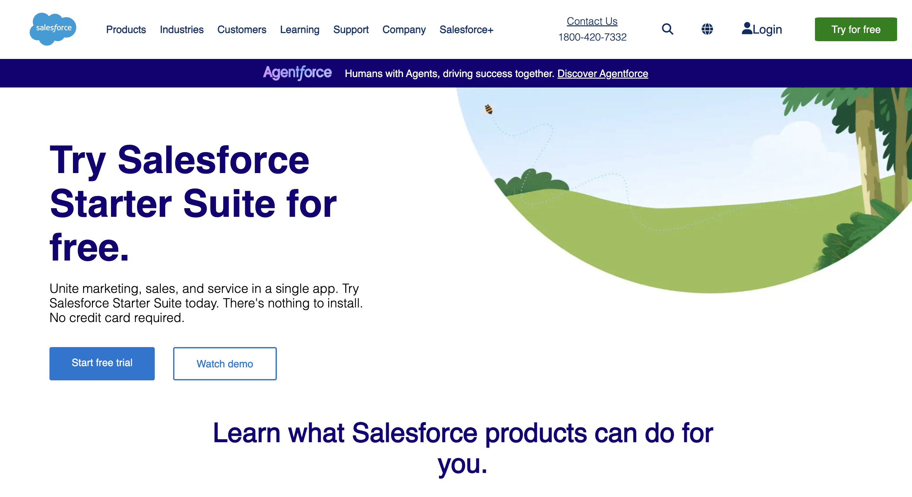
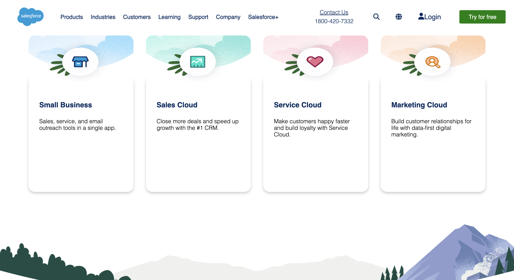

# 🌩️ Salesforce Landing Page Clone

A pixel perfect front end clone of the Salesforce website, built using pure HTML and CSS.
This project focuses on recreating a modern, clean UI while maintaining simplicity and performance.

---

## 🚀 Live Demo

🔗 https://varshitha-padmasali.github.io/salesforce-clone/

---

## 📸 Preview

---

## 📌 About the Project

This project is a front end implementation of the Salesforce landing page.
The main goal was to strengthen my understanding of layout design, spacing, and real world UI replication.

Instead of using frameworks, I built everything from scratch using HTML and CSS to improve core fundamentals.

---

## ✨ Key Features

✔️ Clean and modern UI design
✔️ Responsive layout (mobile friendly)
✔️ Structured and reusable components
✔️ Pixel aligned sections inspired by Salesforce
✔️ Lightweight and fast (no external libraries)

---

## 🛠️ Tech Stack

* HTML5
* CSS3 (Flexbox & Grid)

---

## 📂 Folder Structure

salesforce-clone/
├── index.html
├── style.css
├── assets/
└── README.md

---

## 🎯 What I Learned

* Building real-world UI from scratch
* Improving layout skills using Flexbox & Grid
* Maintaining clean and readable code structure
* Attention to detail in spacing, colors, and alignment

---

## 📈 Future Improvements

* Add JavaScript for interactivity
* Improve animations and transitions
* Enhance accessibility (ARIA, semantic HTML)
* Optimize for better performance

---

## 👩‍💻 Author

**Jinka Varshitha Padmasali**

---

## ⭐ Feedback

If you like this project, feel free to ⭐ the repo!
Suggestions and improvements are always welcome.
